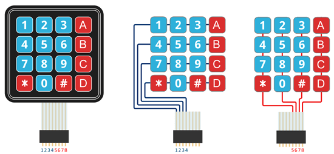

Ejemplo: Uso de teclado matricial.

En este ejemplo, se muestra cómo configurar, conectar y hacer funcionar un teclado matricial con el ESP32. En la documentación se detalla la distribución de los pines y las conexiones. Te recomiendo revisarla para asegurarte de tener la información correcta.


# Nueva version Keypad
Cambios realizado en esta nueva version:
 -  Se cambio el nombre de `keyboard` a `keypad`.
 -  El teclado trabaja en modo polling utilizando una tarea en segundo plano.
 -  El usuario configura una función `callback` para cuando se presionada una tecla.
 -  Cambiaron los pines utilizados para hacer las pruebas.
 - Se aplico técnica simple para manejar el rebote del teclado:
    - Se debe presionar y soltar el botón para generar un evento de tecla presionada.
## Files:

```c  
 matriz_keypad.c
 matriz_keypad.h
```


## GPIO pins connected:




```c  

#define COL_1   GPIO_NUM_4 	// GPIO_NUM_25
#define COL_2   GPIO_NUM_0 	// GPIO_NUM_26
#define COL_3   GPIO_NUM_2 	// GPIO_NUM_27
#define COL_4   GPIO_NUM_15 // GPIO_NUM_14

//rows are output

#define NUM_ROW  4
#define ROW_1    GPIO_NUM_18
#define ROW_2    GPIO_NUM_5
#define ROW_3    GPIO_NUM_17
#define ROW_4    GPIO_NUM_16

```


## ESP32 PINOUT
<p align="left">
  
</p>


## Keypad functions:

 

```c  
/**
 * @brief Teclado compatible con callbacks. 
 * Utiliza una tarea en segundo plano para el polling.
 * 
 * @param cb_key_pressed Callback cuando se presiona una tecla
 * @param cb_get_buffer  Callback cuando se presiona la tecla #, recibe el buffer como parametro
 * @param fclear  Callback que se llama cuando se presiona tecla C, se borra el buffer
 */
void keypad_init( cb_get_key cb_key_pressed,
                  cb_get_buffer cb_get_buffer,
                  cb_clear  fclear);

```


